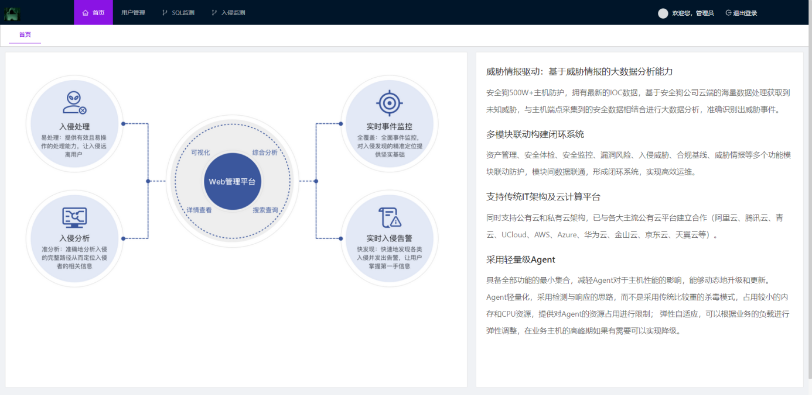
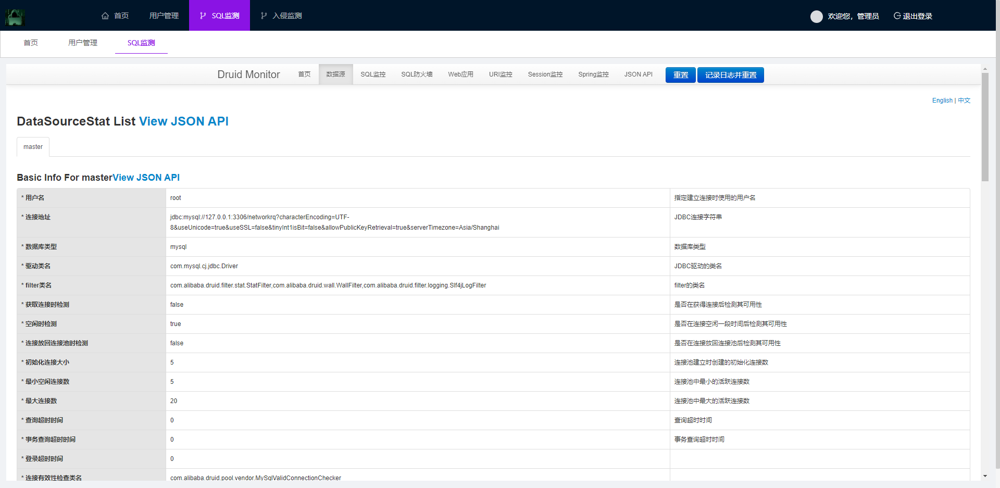
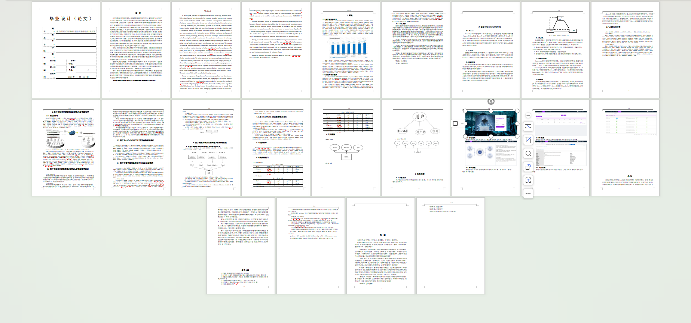

# 13-基于机器学习的网络入侵检测系统


> 更多开源项目：https://docs.qq.com/sheet/DSFZBdFprRW12QWVw
>
> 更多开源项目：https://docs.qq.com/sheet/DSFZBdFprRW12QWVw

> 小技巧：有的项目可能并不是完全符合您的设计需求，比如您的需求是**XXX的交友系统**，其实完全可以用**XXX的论坛系统**来替换，题目都是同样的意思，但是换一种思路，更简单的解决了需求。
>
> **更多开源项目中包含上千套开源项目，已经注明了使用场景需要的可自行查找。**


## 简介

本代码来源于网络,仅供学习使用。若侵权，请联系删除。【**项目均经过人工调试，源码100%确保成功运行**】

本项目包含：**源码+数据库+1w字论文+PPT，可用于毕业设计、期末作业、课设等**

**项目地址：**

```
http://localhost:8080/coderQ/admin/dist/index.html
```

**账号密码：**

```
sql监测：
admin     123456
管理员：
admin       123456
运维用户
yh001       yh001
```


## 关键技术

开发工具：**IntelliJ IDEA，Navicat，Mysql，Pycharm**

主要技术：**SpringBoot，SSM，Spring，SpringMVC，Mybatis，MybatisPlus，Mysql，Html，JS，CSS，Vue，Python，AES算法，Md5算法，RSA算法**


## 使用场景

```
机器学习，网络入侵，网络监测，网络控制
```


## 共同学习

不会部署项目的可以添加VX：【**coderjun666**  】**7*24小时在线，添加秒通过**，共同探讨学习部署。


## 项目截图







